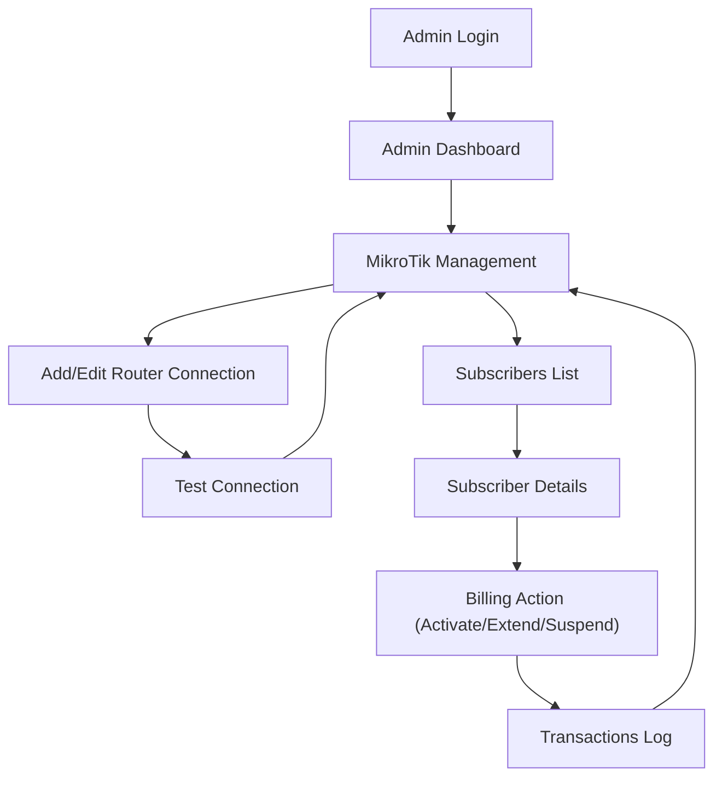

## 1. Product Overview
Bagong “MikroTik Management” page sa Admin Panel na hiwalay sa existing PPPoE management.
Binabasa nito ang MikroTik (RouterOS) API para sa monitoring at billing-related operations (activation/extension/suspension at pag-log ng transactions).

## 2. Core Features

### 2.1 User Roles
| Role | Registration Method | Core Permissions |
|------|---------------------|------------------|
| Admin | Existing admin login sa system | Makakita at makapag-manage ng MikroTik connections, subscribers, at billing operations |

### 2.2 Feature Module
Ang requirements ay may minimum na pages para gumana ang feature:
1. **MikroTik Management (Admin Page/Tab)**: router connection setup, live MikroTik data (via API), subscriber list, billing actions, transaction log.

### 2.3 Page Details
| Page Name | Module Name | Feature description |
|-----------|-------------|---------------------|
| MikroTik Management | Router Connections | Mag-list ng MikroTik routers; mag-add/edit/remove ng connection details (host/port/username/password o API token kung supported); mag-test connection at magpakita ng status (Connected/Failed/Last sync). |
| MikroTik Management | Live Router Snapshot | Magbasa ng basic RouterOS info via API (identity, uptime, resources/health kung available) at i-refresh on demand. |
| MikroTik Management | Subscribers / Accounts | Mag-load ng subscriber list mula MikroTik API (hal. users/secrets/hotspot users depende sa target); mag-search at mag-filter; mag-open ng subscriber details panel. |
| MikroTik Management | Subscriber Details | Magpakita ng key fields (username, profile, status/disabled, last-seen/active-session kung available) at quick actions. |
| MikroTik Management | Billing Operations | Mag-execute ng billing actions para sa subscriber: i-activate, i-extend (renewal), i-suspend/disable; mag-require ng amount, period/plan, at notes; mag-validate bago i-apply. |
| MikroTik Management | Transactions Log | Mag-save at mag-list ng billing transactions (date/time, admin, router, subscriber ref, amount, action, result); mag-filter by date/subscriber; mag-view ng failure reasons. |
| MikroTik Management | Audit & Error Handling | Mag-log ng API errors/timeouts at ipakita ang user-friendly error state; mag-provide ng retry at safe fallback (read-only mode kapag down ang router). |

## 3. Core Process
**Admin Flow**
1) Mag-login ka sa Admin Panel.
2) Buksan mo ang “MikroTik Management” tab.
3) Magdagdag ka ng MikroTik router connection at i-test ang API connectivity.
4) Kapag connected, mag-load ka ng subscribers mula sa router.
5) Piliin mo ang subscriber, then pumili ng billing action (activate/extend/suspend) at ilagay ang amount/plan/notes.
6) System mag-aapply ng action sa MikroTik via API at magre-record ng transaction result.

