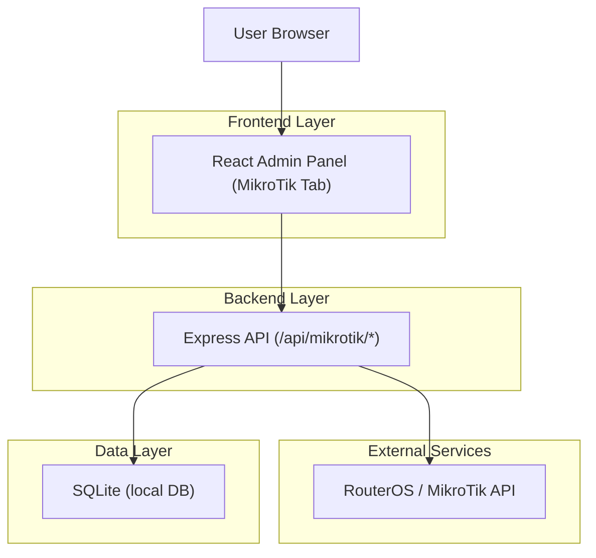
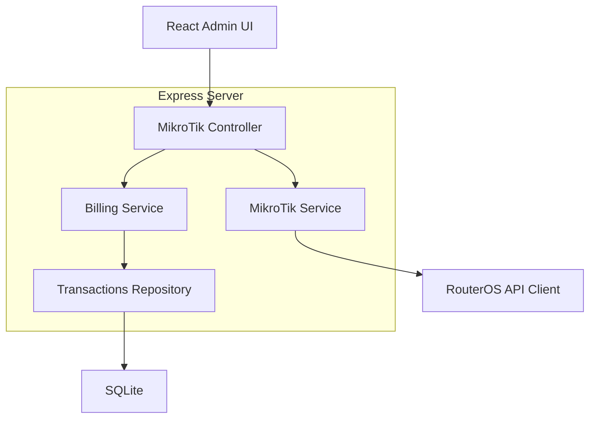
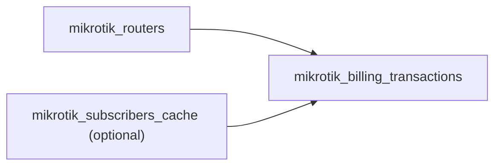

## 1.Architecture design


## 2.Technology Description
- Frontend: React@19 + TypeScript + lucide-react (existing)
- Backend: Node.js + Express@4 (existing)
- Database: SQLite3 (existing local DB)
- MikroTik Integration: RouterOS API client library (Node) para hindi ma-expose ang router credentials sa browser

## 3.Route definitions
| Route | Purpose |
|-------|---------|
| /admin | Admin shell (sidebar + content area) |
| /admin (tab = mikrotik) | MikroTik Management page/tab (router connections, subscribers, billing actions, transactions log) |

## 4.API definitions (If it includes backend services)
### 4.1 Core API
Router connections
```
GET /api/mikrotik/routers
POST /api/mikrotik/routers
PUT /api/mikrotik/routers/:id
DELETE /api/mikrotik/routers/:id
POST /api/mikrotik/routers/:id/test
```

Read MikroTik data
```
GET /api/mikrotik/routers/:id/snapshot
GET /api/mikrotik/routers/:id/subscribers
GET /api/mikrotik/routers/:id/subscribers/:subscriberId
```

Billing operations + transaction logging
```
POST /api/mikrotik/billing/apply
GET  /api/mikrotik/billing/transactions
```

Shared TypeScript types (frontend/back-end)
```ts
export type MikrotikRouterStatus = 'connected' | 'disconnected' | 'error';

export interface MikrotikRouter {
  id: string;
  name: string;
  host: string;
  port: number;
  username: string;
  // NOTE: password/token stored only on server (never returned to frontend)
  status: MikrotikRouterStatus;
  lastCheckedAt?: string;
}

export interface MikrotikSubscriber {
  id: string; // Router-native id o derived id
  username: string;
  profile?: string;
  disabled?: boolean;
  lastSeenAt?: string;
}

export type MikrotikBillingAction = 'activate' | 'extend' | 'suspend';

export interface MikrotikBillingApplyRequest {
  routerId: string;
  subscriberId: string;
  action: MikrotikBillingAction;
  amount: number;
  planName?: string;
  periodDays?: number;
  notes?: string;
}

export interface MikrotikBillingTransaction {
  id: string;
  createdAt: string;
  adminId?: string;
  routerId: string;
  subscriberId: string;
  action: MikrotikBillingAction;
  amount: number;
  planName?: string;
  periodDays?: number;
  result: 'success' | 'failed';
  errorMessage?: string;
}
```

## 5.Server architecture diagram (If it includes backend services)


## 6.Data model(if applicable)
### 6.1 Data model definition


Entities (minimal)
- mikrotik_routers: stored router connection metadata (credentials kept server-side)
- mikrotik_billing_transactions: billing actions history + results
- mikrotik_subscribers_cache (optional): cached snapshot kung kailangan ng mabilis na search/history kahit offline ang router

### 6.2 Data Definition Language
MikroTik Routers
```
CREATE TABLE IF NOT EXISTS mikrotik_routers (
  id TEXT PRIMARY KEY,
  name TEXT NOT NULL,
  host TEXT NOT NULL,
  port INTEGER NOT NULL DEFAULT 8728,
  username TEXT NOT NULL,
  password_encrypted TEXT NOT NULL,
  status TEXT NOT NULL DEFAULT 'disconnected',
  last_checked_at TEXT,
  created_at TEXT NOT NULL,
  updated_at TEXT NOT NULL
);

CREATE INDEX IF NOT EXISTS idx_mikrotik_routers_host ON mikrotik_routers(host);
```

Billing Transactions
```
CREATE TABLE IF NOT EXISTS mikrotik_billing_transactions (
  id TEXT PRIMARY KEY,
  router_id TEXT NOT NULL,
  subscriber_id TEXT NOT NULL,
  subscriber_username TEXT,
  action TEXT NOT NULL,
  amount REAL NOT NULL,
  plan_name TEXT,
  period_days INTEGER,
  notes TEXT,
  result TEXT NOT NULL,
  error_message TEXT,
  created_at TEXT NOT NULL
);

CREATE INDEX IF NOT EXISTS idx_mikrotik_tx_router_id ON mikrotik_billing_transactions(router_id);
CREATE INDEX IF NOT EXISTS idx_mikrotik_tx_subscriber_id ON mikrotik_billing_transactions(subscriber_id);
CREATE INDEX IF NOT EXISTS idx_mikrotik_tx_created_at ON mikrotik_billing_transactions(created_at);
```
